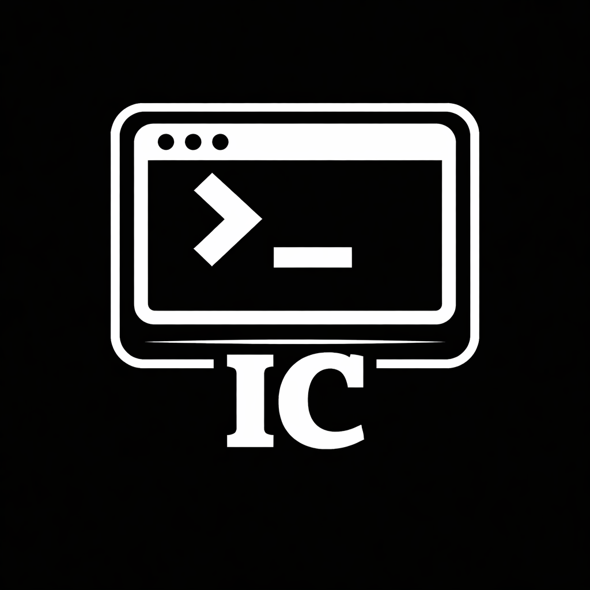

# Terminal IC

a new terminal for your system

## What does he do?

You can create files.

It can mimic an old Terminal.

However, it doesn't have an IDE with PowerShell and CMD.

## How was it done?

I used the Python programming language.

I drew inspiration from old computers and terminals.

And I customized it using the .cmd file.

## Why was it created?

I was studying programming, but then I discovered CMD.

I looked it up and realized it was a very good terminal.

So I started studying CMD, but while doing so, I realized there were some confusing things (Why do you have to use % to format a variable? Why do you have to put a colon before the function name?).

So I decided to create my own terminal.

## Logo Terminal:

